# Cognitive Stress Monitoring & Learning Support System

### An adaptive cognitive assessment and learning-support platform for evaluating cognitive performance, tracking progress, and supporting stress-aware learning.

<p>
```
``
```
**Timed Assessment • Performance Tracking • Stress Monitoring • Learning
Support**

---

## Project Overview

The **Cognitive Stress Monitoring & Learning Support System** is a
software platform that provides a structured, exam-style environment for
cognitive assessment and learning support.

Users can create an account, log in, select an assessment mode and
level, complete a timed 45-question assessment, navigate through
questions, submit the test, and maintain performance history.

The software is also connected to a broader research concept for an
**adaptive embedded system for real-time cognitive stress monitoring and
learning optimization**. The associated patent describes physiological
sensing, short cognitive interactions, individualized baselines, trend
analysis, adaptive thresholds, and closed-loop feedback.

> **Scope:** This repository documents the implemented software
> assessment/data workflow. The patent describes the broader embedded
> hardware architecture; not every patented hardware component is
> claimed as implemented in this Streamlit application.

---

## Why This Project Matters

Conventional examinations primarily measure learning outcomes after an
activity. The broader research concept addresses the need to observe
cognitive stress and workload during active study, detect deviations
from an individual's normal baseline, and provide timely support.

This project therefore combines:

-   structured cognitive testing
-   timed exam interaction
-   performance and attempt history
-   physiological/stress data handling
-   learning resources
-   personalized learning direction

---

# Key Features

## 1. Timed Cognitive Assessment

-   45-question assessment workflow
-   25-minute timed examination
-   Exam and Practice modes
-   Foundation and Advanced attempts
-   Previous / Next navigation
-   Question palette
-   Answered / unanswered / unvisited states
-   Final-question submission
-   Automatic submission support

## 2. Performance Tracking

Assessment history can record:

-   score
-   completion time
-   assessment date
-   assessment type
-   stress-related information when available

This supports comparison across repeated attempts.

## 3. Stress & Physiological Data

The software data layer supports stress/physiological records. The
broader embedded concept uses heart rate, temperature, reaction time,
attention consistency, baseline learning, and temporal trend analysis.

## 4. Learning Resources

The Resources page provides structured preparation across:

-   Logical Reasoning
-   Quantitative Aptitude
-   Verbal Ability
-   Memory & Focus

It also provides study tracks, practice actions, downloadable material,
and improvement targets.

## 5. User Authentication

-   Sign-up
-   Login
-   Session-based user state
-   User-specific assessment history
-   Supabase-backed authentication
-   Password hashing

## 6. Supabase Backend

The application uses Supabase for data storage across areas including:

-   `users`
-   `questions`
-   `health_data`
-   `test_history`

Secrets and local authentication/database files are excluded from the
public repository.

---

# Main Application Pages

| Page | Purpose |
|---|---|
| **Home** | Introduces the assessment platform |
| **Signup** | Creates a user account |
| **Login** | Authenticates users |
| **Dashboard** | Selects assessment mode and level |
| **Assessment** | Runs the timed test |
| **Question View** | Displays questions and options |
| **Final Question** | Provides final submission workflow |
| **Resources** | Provides learning and practice support |

# Application Workflow

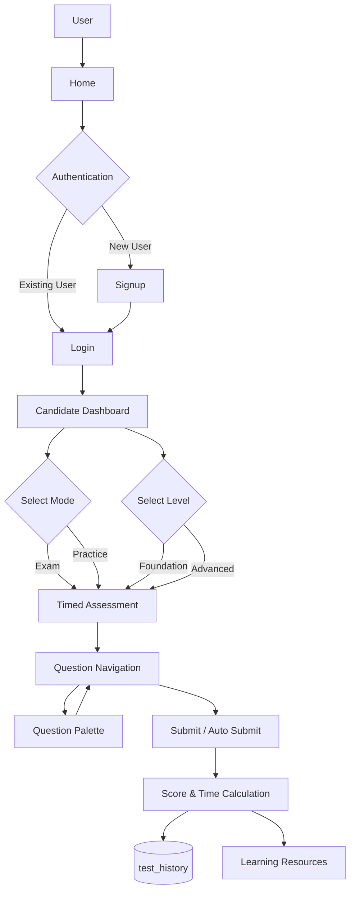

---

# System Architecture

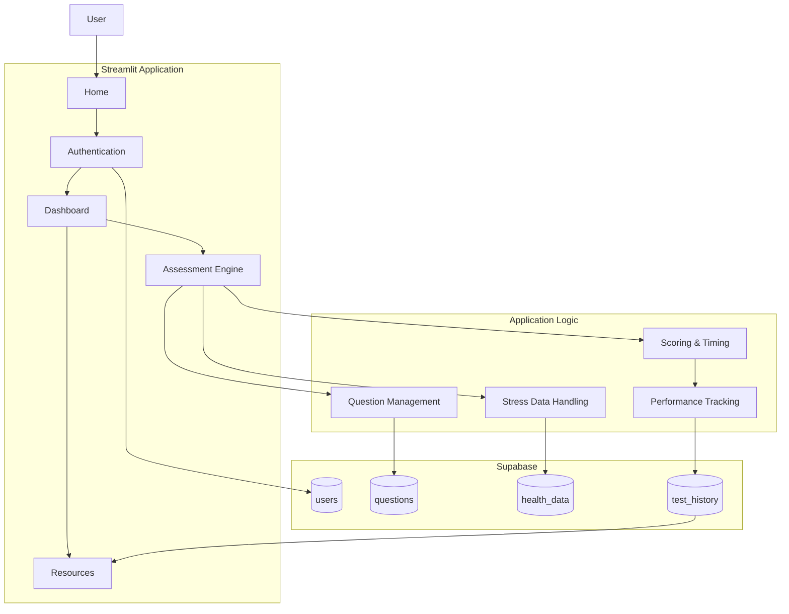

---

# Supabase Data Architecture

```mermaid
erDiagram
    USERS ||--o{ TEST_HISTORY : has

    USERS {
        int id
        string username
        string password_hash
    QUESTIONS {
        int qid
        datetime st_time
        datetime en_time
    HEALTH_DATA {
        int id
        string user
        float heart_rate
        float temperature
        float stress
        datetime timestamp
    TEST_HISTORY {
        int id
        string username
        int score
        float time_taken_seconds
        date date
        string type
        float stress
```

> The exact deployed columns can vary with the current Supabase schema.

---

# Application Screenshots

## 🏠 Home Page

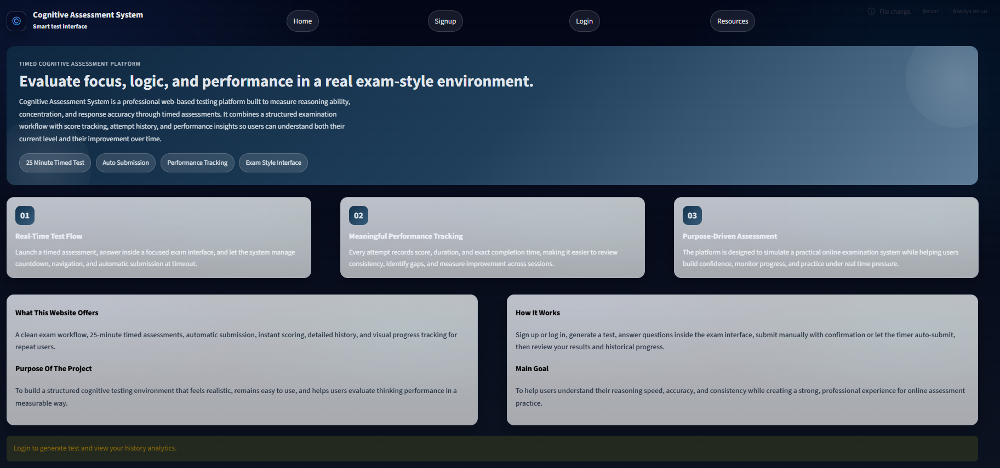
## Login Page

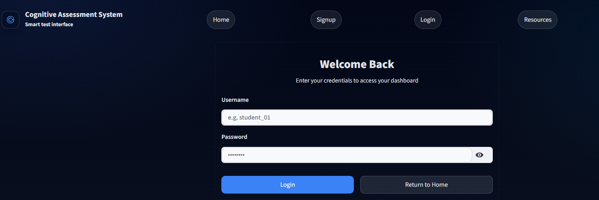
## Signup Page

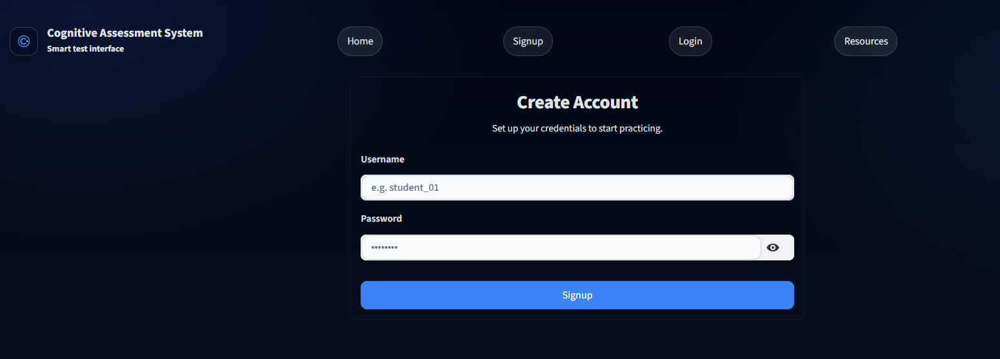
## Candidate Dashboard

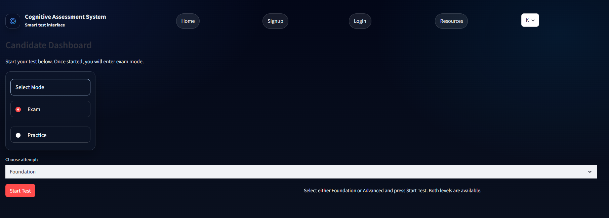
## Assessment Level Selection

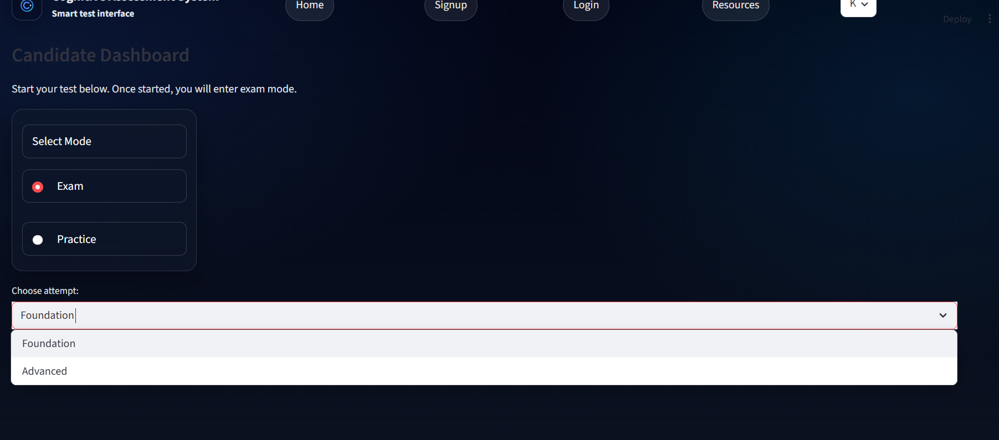
## Assessment Interface

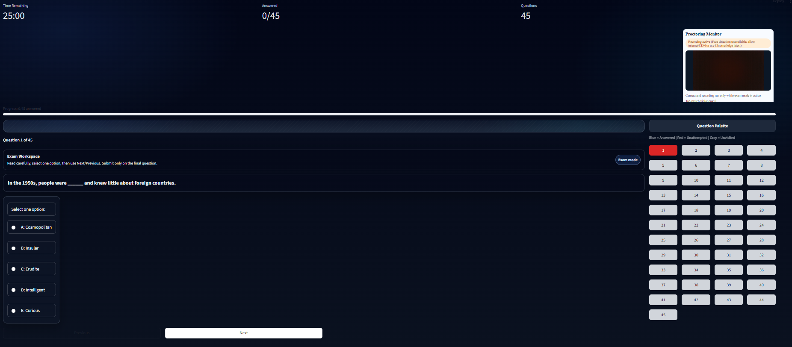
## Assessment Question

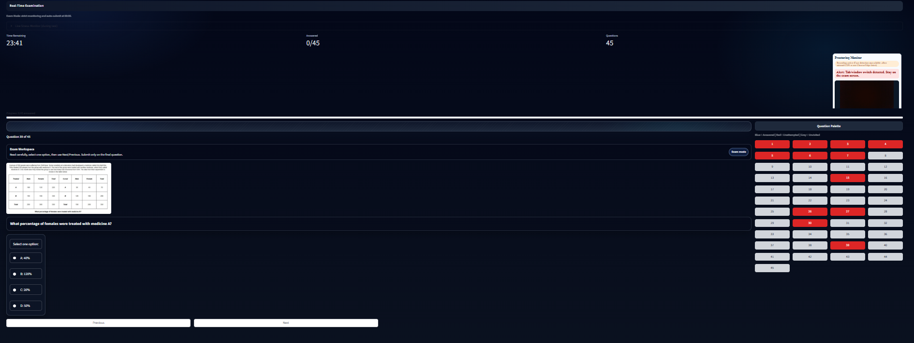
## Final Question

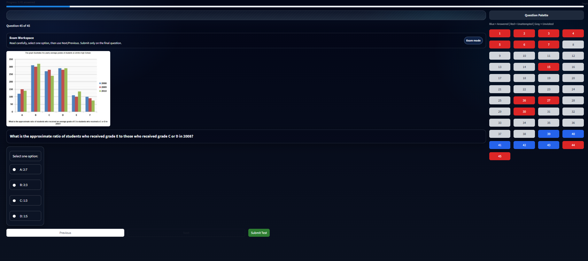
## Learning Resources

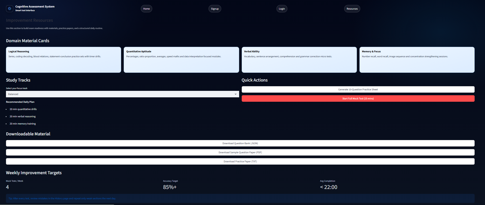

---

# Cognitive Assessment Domains

### Logical Reasoning

Series, coding-decoding, blood relations, statement-conclusion, and
reasoning drills.

### Quantitative Aptitude

Percentages, ratios, averages, arithmetic, and data interpretation.

### Verbal Ability

Vocabulary, sentence arrangement, comprehension, and grammar correction.

### Memory & Focus

Number recall, word recall, image sequences, and concentration
exercises.

---

# Assessment-to-Learning Cycle

``` text
Assessment
Score & Time Analysis
Performance History
Identify Improvement Areas
Learning Resources
Practice
Next Assessment
```

---

# Technology Stack

| Technology | Purpose |
|---|---|
| **Python** | Application logic |
| **Streamlit** | Web interface |
| **Supabase** | Backend database |
| **Passlib / PBKDF2-SHA256** | Password hashing |
| **HTML / CSS** | UI styling |
| **Git / GitHub** | Version control |

# Project Structure

``` text
Cognitive-Stress-Monitoring-Learning-Support-System/
├── .gitignore
├── README.md
├── mini project code/
│   ├── app/
│   │   ├── app.py
│   │   ├── login.py
│   │   └── supabase_db.py
│   ├── database/
│   │   └── database.py
│   └── ...
├── docs/
│   └── ARCHITECTURE.md
└── screenshots/
    └── cognitive-assessment-system-pages-updated/
        ├── home-page.png
        ├── login-page.png
        ├── signup-page.png
        ├── dashboard-page.png
        ├── dashboard-test-selection-page.png
        ├── assessment-page.png
        ├── assessment-question-page.png
        ├── assessment-final-question-page.png
        └── resources-page.png
```

---

# Installation & Setup

## 1. Clone

``` bash
git clone https://github.com/Akaash84/Cognitive-Stress-Monitoring-and-Learning-Support-System.git
cd Cognitive-Stress-Monitoring-Learning-Support-System
```

## 2. Create a virtual environment

### Windows

``` powershell
python -m venv .venv
.venv\Scripts\Activate.ps1
```

### Linux / macOS

``` bash
python3 -m venv .venv
source .venv/bin/activate
```

## 3. Install dependencies

``` bash
pip install -r requirements.txt
```

## 4. Configure Supabase

Provide the required Supabase credentials through environment variables
or Streamlit secrets.

``` toml
SUPABASE_URL = "your-supabase-project-url"
SUPABASE_ANON_KEY = "your-supabase-anon-key"
SUPABASE_SERVICE_ROLE_KEY = "your-service-role-key"
```

**Never commit real credentials to GitHub.**

---

# Run the Application

From the application directory:

``` bash
streamlit run app.py
```

Open the local URL displayed by Streamlit.

---

# Security

The repository follows these practices:

-   passwords are stored as hashes rather than plaintext
-   Supabase credentials are kept outside tracked source
-   local authentication files are ignored
-   local database files are ignored
-   Streamlit secrets are ignored
-   default test credentials are not published in this README

For production deployment, review Supabase Row Level Security,
authorization, secret management, and database access policies.

---

# Patent & Research Context

**Title:** Adaptive Embedded System for Real-Time Cognitive Stress
Monitoring and Learning Optimization

**Application No.:** 202641017456\
**Publication No.:** IN202641017456 A1\
**Filing Date:** 17 February 2026\
**Publication Date:** 27 February 2026\
**IPC:** A61B5/16, G16H20/70

**Applicant:** Vallurupalli Nageswara Rao Vignana Jyothi Institute of
Engineering and Technology (VNRVJIET)

**Inventors:**

1.  Karnam Akhil
2.  Dr. S. Nagini
3.  Manda Akaash
4.  Malladi Sri Raksha
5.  Malapati Pavan
6.  Mahendra Architha

These details are taken from the associated Indian patent publication.

---

# Future Scope

-   ESP32-based physiological sensing
-   real-time heart-rate monitoring
-   temperature monitoring
-   cognitive interaction hardware
-   LED / buzzer feedback
-   individualized cognitive baselines
-   adaptive stress thresholds
-   trend-based cognitive monitoring
-   adaptive question difficulty
-   personalized learning recommendations
-   advanced analytics dashboards
-   cloud deployment
-   automated testing and CI/CD

---

# Privacy & Responsible Use

This project is intended for educational, research, and demonstration
purposes.

Physiological and cognitive information should be collected with
appropriate consent and protected using suitable access controls. The
system should not be treated as a medical diagnostic or treatment tool.

---

# Documentation

Additional documentation is available in:

-   `docs/ARCHITECTURE.md`
-   `screenshots/README.md`

The associated patent document provides the authoritative
patent-specific description of the broader embedded-system invention.

---

# Project Contributor

**Manda Akaash**

Software development, application implementation, integration, documentation, and repository maintenance.

---

# 📄 License

See the repository `LICENSE` file for the applicable terms.

---

### Assess • Analyze • Learn • Improve
